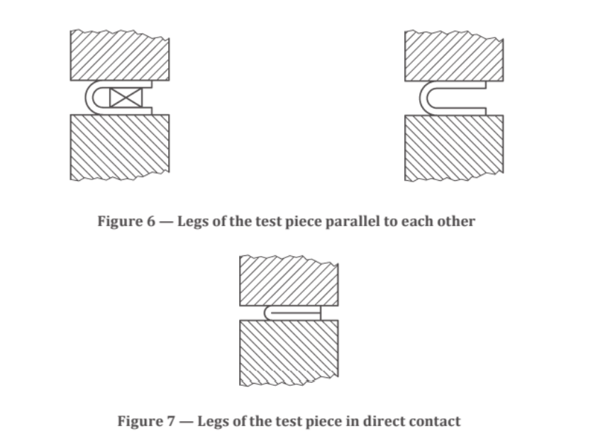

<h3>Bend Test:</h3>
The bend test shall be carried out using one of the following methods as specified in the
relevant standard:
a) a specified angle of bend is achieved under an appropriate force and for the given
conditions (see Figures 1, 2 and 3);
b) the legs of the test piece are parallel to each other at a specified distance apart while
under an appropriate force (see Figure 6);
c) the legs of the test piece are in direct contact while under an appropriate force (see Figure
7).

In the bend test to a specified angle of bend, the test piece shall be placed on the supports
(see Figure 1) or on the V-block (see Figure 2) and bent in the middle between supports by
the action of a force.
The bending shall be applied slowly to permit free plastic flow of the material. In case of
dispute, a testing rate of (1 ± 0.2) mm/s shall be used.
If it is not possible to bend the test piece directly to the specified angle in the manner
described above, the bend shall be completed by pressing directly on the ends of the legs of
the test piece (see Figure 5).
In a bend test requiring parallel legs, the test piece may be bent first, as indicated in Figure
5, and then placed between the parallel plates of the press (see Figure 6), where it is further
formed by application of a force to obtain parallelism of the legs. The test may be carried out
with or without an insert. The thickness of the insert shall be as defined in the relevant
standard or by agreement.

<h3>Rebend Test</h3>
The test piece shall be bent to an included angle of 135˚ using a mandrel of appropriate
diameter.
The bent piece shall be aged by keeping in boiling water (100˚C) for 30 min and then
allowed to cool.
The piece shall be bent to have an included angle of 157.5˚.
Check for any cracks on the tension side.

<h4>Retest</h4>
If any one of the test pieces first selected fail to pass any of the tests specified in this
standard, two further samples shall be selected for testing in respect of each failure. Should
the test pieces from both these additional samples pass, the material represented by the test
samples shall be deemed to comply with the requirements of that particular test. Should the
test piece from either of these additional samples fail, the material presented by the samples
shall be considered as not having complied with this standard.

<h3>Observations:</h3>
Identification of test piece:
Type of material:
Cast number:
Shape of cross-section:
Nominal diameter/Dimension of cross-section:
Length of test piece:
Diameter of mandrel:
Test Method:
<h3>Result:</h3>
The material presented by the given sample has (passed/failed) the bend test.
The material presented by the given sample has (passed/failed) the re-bend test.

Observations:<>
Identification of test piece:
Type of material:
Cast number:
Shape of cross-section:
Nominal diameter/Dimension of cross-section:
Length of test piece:
Diameter of mandrel:
Test Method:
<h3>Result:</h3>
The material presented by the given sample has (passed/failed) the bend test.
The material presented by the given sample has (passed/failed) the re-bend test.
