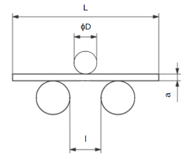

<h3>Bend Test</h3>

The length of the specimen shall not be less than 600 mm.
<ol>
<li>Select a mandrel of appropriate diameter as per Table 1 and attach it to the bending machine. </li>
<li>Place the specimen on the supports as shown and lower down the mandrel to make direct contact with the specimen. 

</li>
<li>Start applying vertical force to the specimen using the hydraulic pump to cause bending. The bending shall be applied slowly to permit free plastic flow of the material. In case of dispute, a testing rate of (1 ± 0.2) mm/s shall be used. </li>
<li>Continue bending the specimen until the two ends are almost parallel to each other. </li>
<li>Lift off the mandrel and take out the specimen. Check for any cracks on the tension side with naked eyes. If there are no cracks, the test piece has passed the test.
</li>
<li>Repeat steps 1 to 5 for another test piece from the given sample.</li>
</ol>

<h3>Re-bend Test</h3>

The lenght of specimen shall not be less than 600 mm.

<ol>
<li>Select a mandrel of appropriate diameter as per Table 2 and attach it to the bending device. </li>
<li>Place the specimen horizontally on the supports and lower down the mandrel to make direct contact with the specimen. Start applying vertical force to the specimen using the hydraulic pump to cause bending. </li>
<li>The bending shall be applied slowly to permit free plastic flow of the material. In case of dispute, a testing rate of (1 ± 0.2) mm/s shall be used. Continue bending the test piece until the included angle becomes 135°.  
</li>
<li>Lift off the mandrel and take out the specimen and measure the angle using an angle protractor. In case you don’t have an angle protractor, you can check the angle by drawing a 135° on paper/cardboard beforehand and then place the bent specimen on the paper/cardboard and compare.</li>
<li>The bent piece shall be aged by keeping in boiling water (100°C) for 30 min and then allowed to cool.</li>
<li>Insert the specimen in the machine but this time with the tension side facing the mandrel.</li>
<li>Bend the piece to have an included angle 157.5°. Check the angle as described in step 4. </li>
<li>Check for any cracks on the tension side. If there are no cracks, the test piece is said to have passed the test.</li>
<li>Repeat steps 1 to 8 for another test piece from the given sample. 

</li>
</ol>

<h3>Retest</h3>
If any one of the test pieces first selected fail to pass the any of the tests specified in this standard, two further samples shall be selected for testing in respect of each failure. Should the test pieces from both these additional samples pass, the material represented by the test samples shall be deemed to comply with the requirements of the particular test. Should the test piece from either of these additional samples fail, the material represented by the samples shall be considered as not having complied with this standard.

<h3>Observations</h3>

<table style="undefined;table-layout: fixed; width: 396px">
<colgroup>
<col style="width: 188.333333px">
<col style="width: 97.333333px">
<col style="width: 110.333333px">
</colgroup>
<thead>
  <tr>
    <th>Parameters </th>
    <th>Bend Test   </th>
    <th>Re-bend Test   </th>
  </tr>
</thead>
<tbody>
  <tr>
    <td>    Identification of test piece   </td>
    <td></td>
    <td></td>
  </tr>
  <tr>
    <td>&nbsp;&nbsp;&nbsp; Type of material&nbsp;&nbsp;&nbsp;</td>
    <td></td>
    <td></td>
  </tr>
  <tr>
    <td>    Shape of cross-section   </td>
    <td></td>
    <td></td>
  </tr>
  <tr>
    <td>&nbsp;&nbsp;&nbsp; Nominal diameter&nbsp;&nbsp;&nbsp;</td>
    <td></td>
    <td></td>
  </tr>
  <tr>
    <td>    Diameter of mandrel   </td>
    <td></td>
    <td></td>
  </tr>
  <tr>
    <td>    Presence of cracks   </td>
    <td></td>
    <td></td>
  </tr>
</tbody>
</table>

<h3>Results</h3>
The material represented by the given sample has (passed/failed) the bend test. 
The material represented by the given sample has (passed/failed) the re-bend test.
