Concrete has very low tensile strength campared to its compressive strength. In a RC beam, as the applied moment exceeds the cracking moment Mcr, the maximum tensile stress in concrete exceeds the flexural tensile strength of concrete fcr, and the beam begins to crack on the tension side. The cracks are initiated in the tensile fibres of the beam, and with increasing loading, widen and propagate gradually towards the neutral axis (NA) resulting in reduction in the effective concrete section. Due to this cracking, the tensile stresses arecarried  solely by the reinforcing steel. The dirstribution strainsand stressesin a singly reinforced RC beam for uncracked phase and craked phase is shown in figures below.

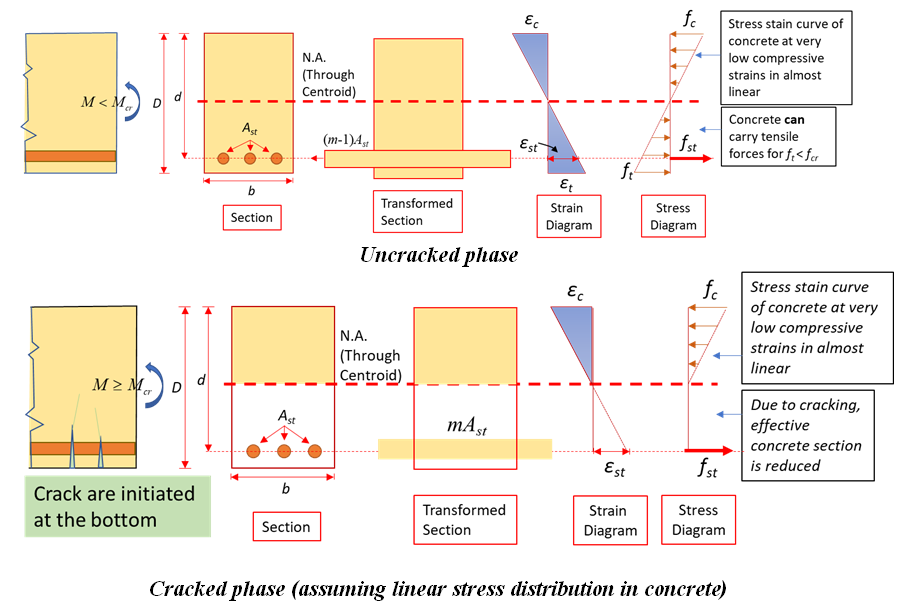 
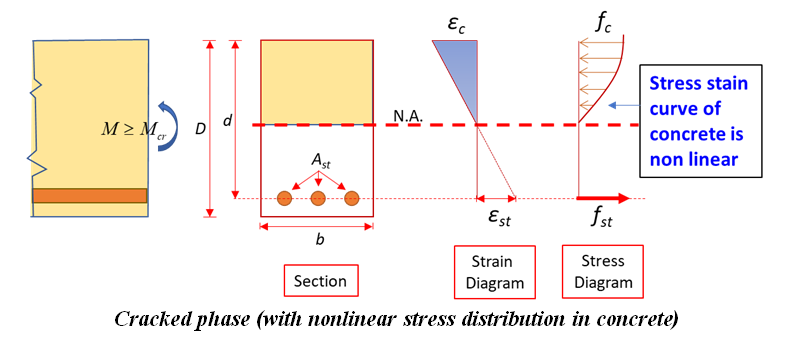

<strong>Modes of failure of a concrete beam</strong> 

A reinforced concrete beam is considered to have failed when the strain of concrete in extreme compression fibre reaches its ultimate value (εc=εcu), irrespective of whether the tension steel yielded or not. At this stage, the actual strainin steel εst ,can have the following values:

  a) Equal to failure strain of steel corresponding to balanced section (εst=εy).

  b) More than failure strain, corresponding to under reinforced section(εst >εy).

  c) Less than failure strain corresponding to over reinforced section(εst <εy).

<i>Balanced section</i>

The strain in steel and strain in concrete reach their maximum values simultaneously. The percentage of tension steel in this beam is known as critical or limiting steel percentage (pt,lim). For this section the depth of neutral axis (NA) isxu = xu,max.  

<i>Under-reinforced section </i>

An under-reinforced beam is the one in which tension steel percentage (pt) is less than critical or limiting percentage (pt,lim). Due to this, the NA is above the balanced NA and xu<xu,max

<i>Over-reinforced section</i>
  
In the over reinforced beam, the tension steel percentage is more than limiting percentage due to which NA falls below the balanced NA and xu>xu,max. Because of higher percentage of tension steel, yield does not take place in steel and failure occurs when the strain in extreme fibres in concrete reaches its ultimate value.  

<strong>Flexural behaviour of under reinforced beam </strong>
  
During an experiment, to determine the moment curvature relationship, the factors of safety as mentioned during design (FOS steel 1.15 and FOS concrete 1.5) should not be used.

The description of symbols used in the calculations are given below.

Xu= depth of neutral axis(mm) 
fy= characteristic strength of steel (MPa) 
Ast= area of steel in tension(mm2) 
b= width of the beam(mm) 
fck= characteristic strength of concrete (MPa) 
ft= tensile strength of concrete (MPa) 
Es= young modulus of steel (MPa) 
Ec= elastic modulus of concrete (MPa) 
m= modular ratio (Es/Ec) 
M= bending moment (KNm) 
D=depth of the beam(mm) 
d=effective depth of the beam (mm) 
h=depth of neutral axis (mm) 
I= gross moment of inertia(mm4) 
Its=transformed moment of inertia(mm4) 
L=length of the beam(m) 
εst = strain in steel 

Cracking moment using gross section

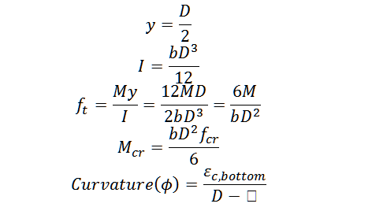 

Cracking moment using transformed section

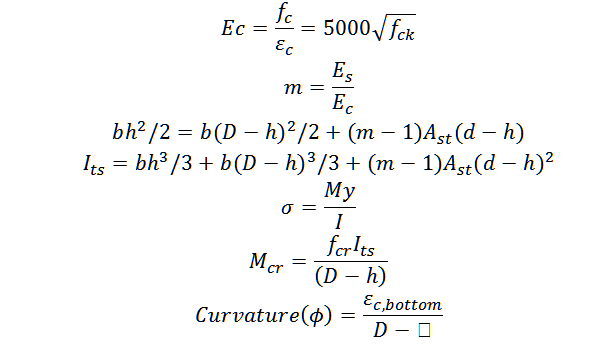 

Moment at the point when steel yields (assuming linear stress distribution in concrete)

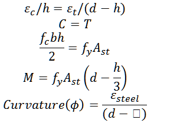 

Ultimate moment (as per Limit state design method given in IS456)

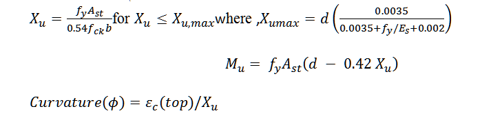  

<strong>Sample calculations:</strong>
  
D= 200
  
d = 200 – 20 – 6 = 174 (using12 mm logitudinalbars and 6 mm stirrups)
  
b=150
  
Ast=226.19
  
fck=30

fy =565(Determined by tensile test on rebar)
  
fmean=34.5  (Determined using cube strength test)

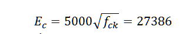 

Cracking moment using gross section

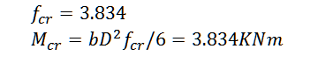 

Cracking moment using transformed section

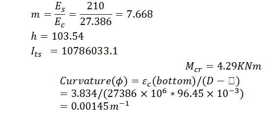 

Moment when steel yields (Assuming linear stress distribution in concrete)

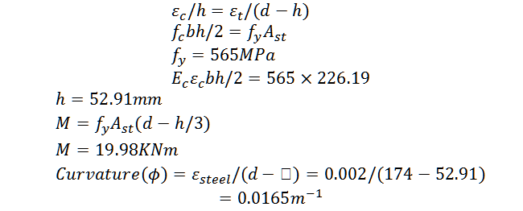 

Ultimate moment

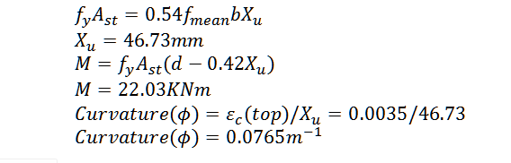  

<strong>Apparatus and specimens</strong>
A combination of tensile, compressive and shear stresses usually determines the strength of the concrete beam when it is subjected to flexure or bending loads. In this test, to study the flexural behavior of the concrete beam, a four-point (also called the third point) loading setup as shown in the figure below is selected. The middle portion of the beam is subjected to pure flexure as shear stress in this region is zero. 

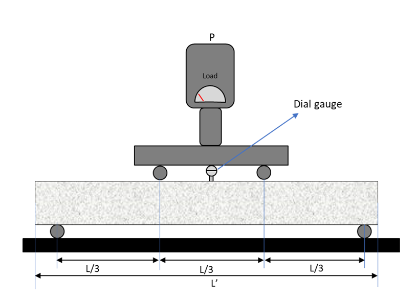  

Four-point loading setup

Strain gauges

Dial gauge

Beam specimen (as showin in the figure below) – 1 nos. (recommended values: L’=2000, L = 1800 mm, LAA = 600 mm, b = 150 mm, D= 200 mm, cover = 20 mm (to shear reinforcement), Ast = 2-12&#8709;
, Steel grade = Fe500, Concrete grade = M20)
  
Concrete cubes for compressive strength test – 3 nos.
  
Concrete beams for flexural strength test– 3 nos.
  
Steel reinforcement, same as used in beam specimen – 600 mm (approx.) for tensile strength test.

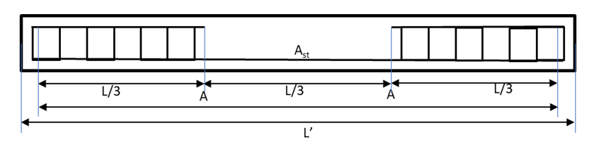  

<!-- A reinforced concrete beam is considered to have failed when the strain of concrete in extreme compression fibre reaches its ultimate value (εc=εcu), irrespective of whether the tension steel yielded or not. At this stage, the actual strainin steel εst ,can have the following values:

where fck is the characteristic strength of concrete in MPa. This specified value is given after taking long term effects, i.e., creep etc, and other safety factors into account, for design purposes. To know the accurate value of elastic modulus of a concrete batch, laboratory test can be done.

The stress strain curve of concrete, when loaded in compression is not linear. This is because of internal micro cracking which occurs during the application of the load. A virgin specimen generally exhibits more marked curvilinearity. Because of this curvilinear nature of the curve, three times of moduli of elasticity can be defined:

<ul>1. Tangent modulus at a specified strain level</ul>
<ul>2. Initial tangent modulus</ul>
<ul>3. Secant modulus</ul>

It is difficult to determine, from static load test, the initial tangent modulus precisely. Other tests such as resonance vibration or ultrasonic pulse velocity test called dynamic tests can be used to determine it approximately. The secant modulus varies least with increasing stress/strain level and hence has been adopted by all codes of practice to define the static modulus of elasticity. Further, to ensure a degree of consistency, the effects of hysteresis (due to repeated loading and unloading) must be eliminated and the secant value determined at specified stress levels. A specimen which has been loaded and unloaded several times (up to a reasonable level of stress) will exhibit a nearly linear stress strain curve up to 30% to 40% of its ultimate strength.

For design purposes the static modulus of elasticity is considered equivalent to the chord modulus of deformation when the test specimen is loaded Fc/9 MPa and Fc/3 MPa where Fc is average cylindrical compressive strength of concrete at 28 days age. The loading profile for determining the static modulus of elasticity of hardened concrete is shown in the figure below.

<table style="width: 600px">
    <tr style="background-color: #000; color: #FFF; text-align : center;">
       <td colspan="2" style="padding: 10px">Apparatus:</td>
   </tr>
   <tr>
      <td style="padding: 10px">Name</td>
      <td>Remarks</td>
   </tr>
   <tr>
      <td style="padding: 10px">CTM</td>
      <td style="padding: 10px">Conforming to IS 14858. The compression testing machine shall be capable of applying loads at a specified rate and maintaining it at the required level.</td>
   </tr>
   <tr>
      <td style="padding: 10px">Strain measuring apparatus</td>
      <td style="padding: 10px">Strain gauges, Compressometer-Extensometers</td>
   </tr>
</table>

Number of specimens:

For measuring the modulus of elasticity- Two cylindrical specimens of preferably diameter 150 mm and height 300 mm casted with the same concrete mix and batch as cubes. For measuring the compressive strength- Three concrete cubes of side 150 mm.

Testing conditions: Normally test shall be made when the specimens reach the age of 28 days. -->
