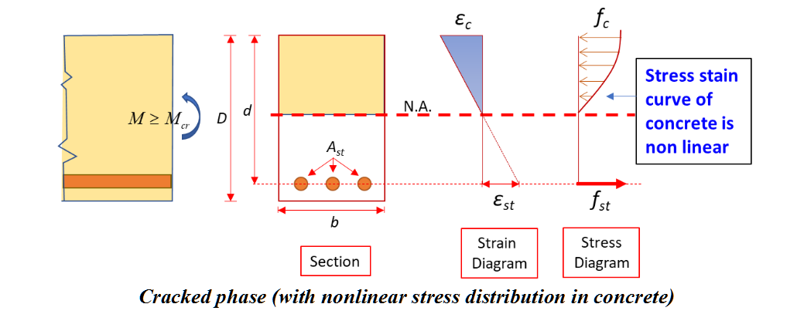
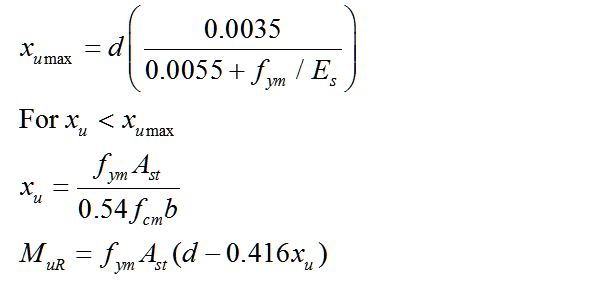
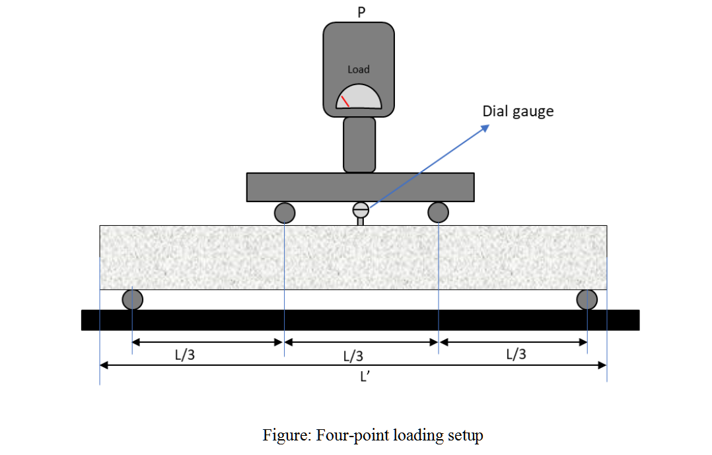
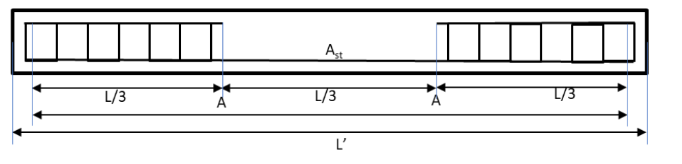
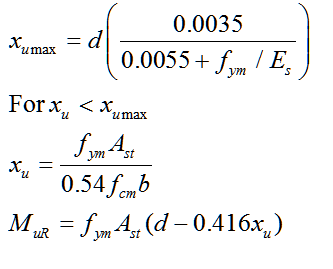

### Theory:

Concrete has very low tensile strength campared to its compressive strength. In a RC beam, as the applied moment exceeds the cracking moment Mcr, the maximum tensile stress in concrete exceeds the flexural tensile strength of concrete fcr, and the beam begins to crack on the tension side. The cracks are initiated in the tensile fibres of the beam, and with increasing loading, widen and propagate gradually towards the neutral axis (NA) resulting in reduction in the effective concrete section. Due to this cracking, the tensile stresses are carried  solely by the reinforcing steel. The dirstribution strains and stresses in a singly reinforced RC beam for uncracked phase and craked phase is shown in figures below.

<strong>Modes of failure of a concrete beam</strong>

A reinforced concrete beam is considered to have failed when the strain of concrete in extreme compression fibre reaches its ultimate value (εc=εcu), irrespective of whether the tension steel yielded or not. At this stage, the actual strain in steel εst , can have the following values:

a) Equal to failure strain of steel corresponding to balanced section (εst=εy).

b) More than failure strain, corresponding to under reinforced section (εst >εy).

c) Less than failure strain corresponding to over reinforced section (εst <εy).

<i>Balanced section</i>

The strain in steel and strain in concrete reach their maximum values simultaneously. The percentage of tension steel in this beam is known as critical or limiting steel percentage (pt,lim). For this section the depth of neutral axis (NA) is xu = xu,max.

<i>Under-reinforced section</i>

An under-reinforced beam is the one in which tension steel percentage (pt) is less than critical or limiting percentage (pt,lim). Due to this, the NA is above the balanced NA and xu < xu,max

<i>Over-reinforced section</i>

In the over reinforced beam, the tension steel percentage is more than limiting percentage due to which NA falls below the balanced NA and xu > xu,max. Because of higher percentage of tension steel, yield does not take place in steel and failure occurs when the strain in extreme fibres in concrete reaches its ultimate value.

<strong>Flexural behaviour of under reinforced beam</strong>

During an experiment, to estimate the ultimate moment resistance, the factors of safety as mentioned during design (FOS steel 1.15 and FOS concrete 1.5) should not be used.

The description of symbols used in the calculations are given below.

L=span of the beam(m)

D=depth of the beam(mm)

d=effective depth of the beam (mm)

b= width of the beam(mm)

Ast= area of steel in tension(mm2)

Es= young modulus of steel (MPa)

fym= mean yield strength of steel (MPa)

fcm= mean cube strength of concrete (MPa)

xu= depth of neutral axis(mm)

<i>Ultimate moment (as per Limit state design method given in IS456)</i>

<strong>Apparatus and specimens</strong>

In this test, to study the flexural behavior of the concrete beam, a four-point (also called the third point) loading setup as shown in the figure below is selected. The middle portion of the beam is subjected to pure flexure as shear stress in this region is zero.

Beam specimen (as show in in the figure below) – 1 nos.

Recommended values:

L’=2000

L = 1800 mm

LAA = 600 mm

b = 150 mm

D= 200 mm

Cover = 25 mm (to shear reinforcement)

Ast = 2-12φ

Steel grade = Fe500

Concrete grade = M25

Concrete cubes for compressive strength test – 3 nos.

Steel reinforcement, same as used in beam specimen – 600 mm (approx.) for tensile strength test.

<strong>Observation</strong>

b= 

D=	

d=

Ast=

Concrete grade -            fcm =

Steel grade –				fym =

<strong>Calculations:</strong>

Obseved failure mode (UR/OR)

Estimated MuR 

<strong>Results:</strong>

Obseved failure mode (UR/OR) = 
Estimated MuR  =
Observed MuR  =
