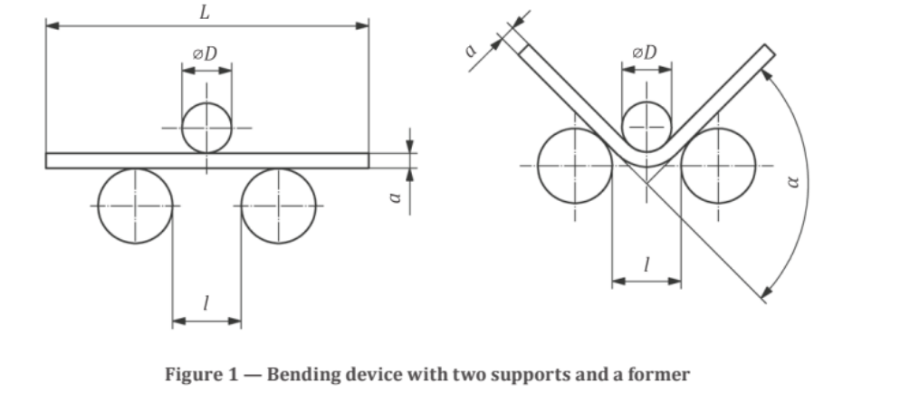
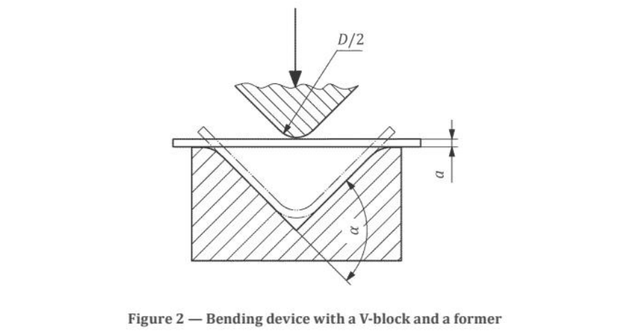
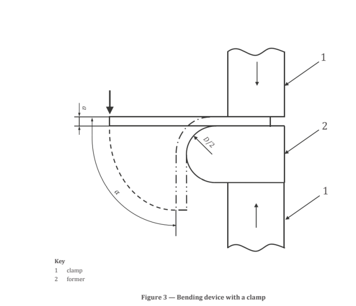
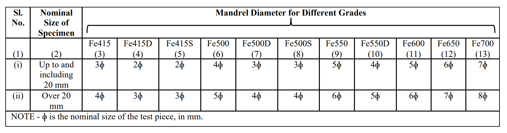
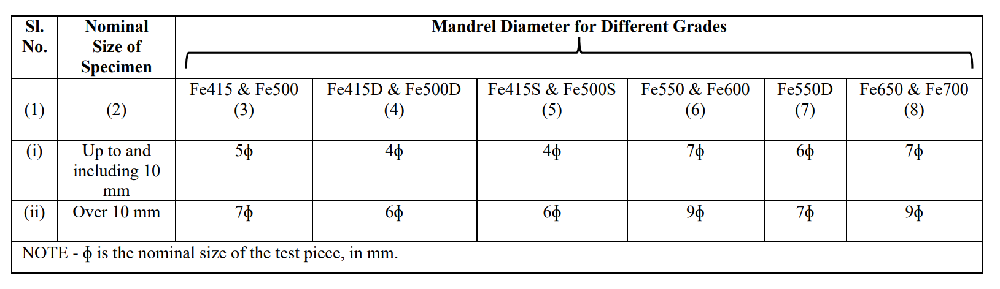

Reinforcing bars are used in reinforced concrete and are one of the main parts of
R.C.C. structure. For that reason, quality of plain and deformed bars should be
checked specially for yield, ultimate strength and elongation (ductility). The most
important test is the tensile strength test. But sometimes bending test is also done.
Tension test provides information on the strength and ductility of materials under
uniaxial tensile stresses. This information may be useful in comparisons of materials,
alloy development, quality control and design under certain circumstances. Bend test is
also a method for evaluating ductility but it cannot be considered as a quantitative
means of predicting service performance in bending operations.
The bending test of TMT bars is performed to test the steel ductility without affecting the
steel strength. The bend test consists of submitting a test piece of round, square, rectangular
or polygonal cross-section to plastic deformation by bending, without changing the direction
of loading, until a specified angle of bend is reached.
Conversely, the re-bend test is used to measure the effects of strain aging on steel. Strainageing is a type of behaviour, usually associated with the yield-point phenomenon, in which
the strength of a metal is increased, and the ductility is decreased on heating at a relatively
low temperature after cold working. In steel, embrittlement can occur due to the diffusion of
nitrogen after cold deformation that occurs with strain aging. The test procedure consists of
bending, ageing, rebending and inspection, respectively.

<h3>Equipment:</h3>
The bend test shall be carried out in testing machines or presses equipped with the following
devices:
a) bending device with two supports and a former as shown in Figure 1

4.2.1 The diameter of the former is determined by the product standard. The test piece
supports and the former shall be of sufficient hardness (see Figure 1).
4.2.2 Unless otherwise specified, the distance between the supports, 𝑙, shall be: 
l = ( D + 3a ) ± a/2 

and shall not change during the bend test. 
b) bending device with a V-block and a former as shown in Figure 2

The tapered surfaces of the V-block shall form an angle of 180°− α (see Figure 2). The angle
α is specified in the relevant standard.
The edges of the V-block shall have a radius between 1 to 10 times the thickness of the test
piece and shall be of sufficient hardness.
c) bending device with a clamp as shown in Figure 3

The device consists of a clamp and a former of sufficient hardness; it may be equipped with
a lever for applying force to the test piece (see Figure 3).
Because the position of the left face of the clamp could influence the test results, the left face
of the clamp (as shown in Figure 3) should not reach up to or beyond the vertical line
through the centre of the circular former shape.

<h3>Test Piece</h3>
<h4>Width</h4>
The width of the test piece shall be as follows:
a) the same as the product width, if the latter is equal to or less than 20 mm;
b) when the width of a product is more than 20 mm:
1) (20 ± 5) mm for products of thickness less than 3 mm,
2) between 20 mm and 50 mm for products of thickness equal to or greater than 3
mm.
<h4>Thickness</h4>
The thickness of test pieces from sheets, strips and sections shall be equal to the thickness
of the product to be tested. If the thickness of the product is greater than 25 mm, it may be
reduced by machining one surface to attain a thickness not less than 25 mm. During
bending, the unmachined side shall be on the tension-side surface of the test piece.

<h4>Lenght</h4>
The length of the test piece depends on the thickness of the test piece and the test
equipment used. Unless specified, the length of the specimen shall not be less than 600
mm

<h3>Mandrel Diameter</h3>
<h4>Bend Test</h4>
The diameter of the mandrel shall be as follows:

<h4>Re-bend Test</h4>
The diameter of the mandrel shall be as follows:

<h3>Apparatus</h3>
<h4>Bend Test:</h4>
a) Bend test arrangement
b) Test piece
c) Mandrels for bend tests
d) Vernier caliper
e) Micrometer
<h4>Re-bend Test:</h4>
a) Re-bend testing arrangement
b) Test piece
c) Mandrels for re-bend testing
d) Temperature controlled water bath
e) Vernier caliper
f) Micrometer
g) Angle protector
h) Stop watch
i) Magnifying glass
