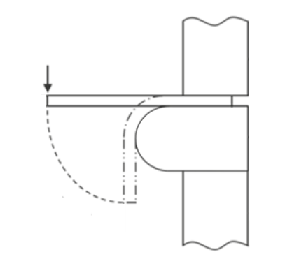

<h3>Introduction</h3>
Reinforcing bars are used in reinforced concrete and are one of the main parts of R.C.C structure. In concrete structures, reinforcement bars carry tensile stresses after concrete cracking. This is because concrete exhibits very high compression strength but low tensile capacity. The bond between the reinforcement and the concrete transfers the tensile stresses to the bars. At the site, bars are bent and re-bent as per the requirements. That’s why it becomes essential to understand the behaviour of reinforcement bars under bend and re-bend conditions.  
&nbsp;&nbsp;&nbsp;&nbsp;&nbsp;&nbsp;&nbsp;&nbsp; The most important test performed on reinforcement to determine the mechanical properties is the tensile strength test. It provides information on the strength and ductility of materials under uniaxial tensile stresses. But sometimes bending test is also performed. The bend test indicates the adequacy or otherwise of the material to undergo required deformation without fracturing or yielding. In this test, the test piece, when cold, shall be doubled over the mandrel by continuous pressure until the sides are parallel. The specimen shall be considered to have passed the test if there is no rupture or cracks visible to a person of normal or corrected vision on the bent portion. 
  
&nbsp;&nbsp;&nbsp;&nbsp;&nbsp;&nbsp;&nbsp;&nbsp; The re-bend test is used to measure the effects of strain-ageing on steel. Strain-ageing is a type of behaviour, usually associated with the yield-point phenomenon, in which the strength of a metal is increased, and the ductility is decreased after it had been retested after a previous series of testing in the plastic range. In steel, strain ageing is due to the diffusion of small elements such as carbon and nitrogen to crystal flaws (e.g. dislocations). The test procedure consists of bending, ageing, re-bending and inspection, respectively.
 
<h3>Apparatus</h3>
The bend test shall be carried out in testing machines or presses equipped with a bending device with two supports and a mandrel as shown in Figure 1.
 

 
The diameter of the mandrel is determined by the test piece. The supports and the mandrel shall be of sufficient hardness. Unless otherwise specified, the distance between the supports, l, shall be: l = ( D + 3a ) ± a/2 and shall not change during the bend test. 
 
&nbsp;&nbsp;&nbsp;&nbsp;&nbsp;&nbsp;&nbsp;&nbsp;Other types of bending equipment that can be used are V-block as shown in Figure 2 or bending device with a clamp as shown in Figure 3.
 

 

 
<h4>Apparatus for Bend Test</h4>
<ol>
<li>Bend Test Arrangement</li>
<li>Mandrels for bend tests</li>
</ol>
 
<h4>Apparatus for Re-bend Test</h4>
<ol>
<li>Bend Test Arrangement</li>
<li>Mandrels for re-bend tests</li>
<li>Temperature controlled water bath</li>
<li>Angle protractor</li>
<li>Stopwatch</li>
</ol>

<h4>Mandrel</h4>
A mandrel is a core around which workpiece can be bent, forged, or moulded. The diameter of the mandrel for the bend and re-bend test shall be as per Table 1 and Table 2.

<h4>Table 1: Mandrel Diameter for Bend Test</h4>
 
<table>
<thead>
  <tr>
    <th>Sl.No.&nbsp;&nbsp;&nbsp;</th>
    <th>Nominal Size of Specimen&nbsp;&nbsp;&nbsp;</th>
    <th colspan="11">  Mandrel Diameter for Different Grades         </th>
  </tr>
</thead>
<tbody>
  <tr>
    <td>&nbsp;&nbsp;&nbsp;   &nbsp;&nbsp;&nbsp; (1)&nbsp;&nbsp;&nbsp;</td>
    <td>&nbsp;&nbsp;&nbsp;   &nbsp;&nbsp;&nbsp; (2)&nbsp;&nbsp;&nbsp;</td>
    <td>&nbsp;&nbsp;&nbsp; Fe415 &nbsp;&nbsp;&nbsp; (3)&nbsp;&nbsp;&nbsp;</td>
    <td>&nbsp;&nbsp;&nbsp; Fe415D &nbsp;&nbsp;&nbsp; (4)&nbsp;&nbsp;&nbsp;</td>
    <td>&nbsp;&nbsp;&nbsp; Fe415S &nbsp;&nbsp;&nbsp; (5)&nbsp;&nbsp;&nbsp;</td>
    <td>&nbsp;&nbsp;&nbsp; Fe500 &nbsp;&nbsp;&nbsp; (6)&nbsp;&nbsp;&nbsp;</td>
    <td>&nbsp;&nbsp;&nbsp; Fe500D &nbsp;&nbsp;&nbsp; (7)&nbsp;&nbsp;&nbsp;</td>
    <td>&nbsp;&nbsp;&nbsp; Fe500S &nbsp;&nbsp;&nbsp; (8)&nbsp;&nbsp;&nbsp;</td>
    <td>&nbsp;&nbsp;&nbsp; Fe550 &nbsp;&nbsp;&nbsp; (9)&nbsp;&nbsp;&nbsp;</td>
    <td>&nbsp;&nbsp;&nbsp; Fe550D &nbsp;&nbsp;&nbsp; (10)&nbsp;&nbsp;&nbsp;</td>
    <td>&nbsp;&nbsp;&nbsp; Fe600 &nbsp;&nbsp;&nbsp; (11)&nbsp;&nbsp;&nbsp;</td>
    <td>&nbsp;&nbsp;&nbsp; Fe650 &nbsp;&nbsp;&nbsp; (12)&nbsp;&nbsp;&nbsp;</td>
    <td>&nbsp;&nbsp;&nbsp; Fe700 &nbsp;&nbsp;&nbsp; (13)&nbsp;&nbsp;&nbsp;</td>
  </tr>
  <tr>
    <td>&nbsp;&nbsp;&nbsp; (i)&nbsp;&nbsp;&nbsp;</td>
    <td>&nbsp;&nbsp;&nbsp; Up to and including 20 mm&nbsp;&nbsp;&nbsp;</td>
    <td>&nbsp;&nbsp;&nbsp; 3ɸ&nbsp;&nbsp;&nbsp;</td>
    <td>&nbsp;&nbsp;&nbsp; 2ɸ&nbsp;&nbsp;&nbsp;</td>
    <td>&nbsp;&nbsp;&nbsp; 2ɸ&nbsp;&nbsp;&nbsp;</td>
    <td>&nbsp;&nbsp;&nbsp; 4ɸ&nbsp;&nbsp;&nbsp;</td>
    <td>&nbsp;&nbsp;&nbsp; 3ɸ&nbsp;&nbsp;&nbsp;</td>
    <td>&nbsp;&nbsp;&nbsp; 3ɸ&nbsp;&nbsp;&nbsp;</td>
    <td>&nbsp;&nbsp;&nbsp; 5ɸ&nbsp;&nbsp;&nbsp;</td>
    <td>&nbsp;&nbsp;&nbsp; 4ɸ&nbsp;&nbsp;&nbsp;</td>
    <td>&nbsp;&nbsp;&nbsp; 5ɸ&nbsp;&nbsp;&nbsp;</td>
    <td>&nbsp;&nbsp;&nbsp; 6ɸ&nbsp;&nbsp;&nbsp;</td>
    <td>&nbsp;&nbsp;&nbsp; 7ɸ&nbsp;&nbsp;&nbsp;</td>
  </tr>
  <tr>
    <td>&nbsp;&nbsp;&nbsp; (ii)&nbsp;&nbsp;&nbsp;</td>
    <td>&nbsp;&nbsp;&nbsp; Over 20 mm&nbsp;&nbsp;&nbsp;</td>
    <td>&nbsp;&nbsp;&nbsp; 4ɸ&nbsp;&nbsp;&nbsp;</td>
    <td>&nbsp;&nbsp;&nbsp; 3ɸ&nbsp;&nbsp;&nbsp;</td>
    <td>&nbsp;&nbsp;&nbsp; 3ɸ&nbsp;&nbsp;&nbsp;</td>
    <td>&nbsp;&nbsp;&nbsp; 5ɸ&nbsp;&nbsp;&nbsp;</td>
    <td>&nbsp;&nbsp;&nbsp; 4ɸ&nbsp;&nbsp;&nbsp;</td>
    <td>&nbsp;&nbsp;&nbsp; 4ɸ&nbsp;&nbsp;&nbsp;</td>
    <td>&nbsp;&nbsp;&nbsp; 6ɸ&nbsp;&nbsp;&nbsp;</td>
    <td>&nbsp;&nbsp;&nbsp; 5ɸ&nbsp;&nbsp;&nbsp;</td>
    <td>&nbsp;&nbsp;&nbsp; 6ɸ&nbsp;&nbsp;&nbsp;</td>
    <td>&nbsp;&nbsp;&nbsp; 7ɸ&nbsp;&nbsp;&nbsp;</td>
    <td>&nbsp;&nbsp;&nbsp; 8ɸ&nbsp;&nbsp;&nbsp;</td>
  </tr>
  <tr>
    <td colspan="13">NOTE - ɸ is the nominal size of the test piece, in mm.</td>
  </tr>
</tbody>
</table>

<h4>Table 2: Mandrel Diameter for Re-bend Test</h4>
 
<table>
<thead>
  <tr>
    <th>   Sl. No.   </th>
    <th>Nominal Size of Specimen    </th>
    <th colspan="6">   Mandrel Diameter for Different Grades   </th>
  </tr>
</thead>
<tbody>
  <tr>
    <td>          (1)   </td>
    <td>&nbsp;&nbsp;&nbsp;   &nbsp;&nbsp;&nbsp; (2)&nbsp;&nbsp;&nbsp;</td>
    <td>&nbsp;&nbsp;&nbsp; Fe415 &amp; Fe500 &nbsp;&nbsp;&nbsp; (3)&nbsp;&nbsp;&nbsp;</td>
    <td>&nbsp;&nbsp;&nbsp; Fe415D &amp; Fe500D &nbsp;&nbsp;&nbsp; (4)&nbsp;&nbsp;&nbsp;</td>
    <td>&nbsp;&nbsp;&nbsp; Fe415S &amp; Fe500S &nbsp;&nbsp;&nbsp; (5)&nbsp;&nbsp;&nbsp;</td>
    <td>&nbsp;&nbsp;&nbsp; Fe550 &amp; Fe600 &nbsp;&nbsp;&nbsp; (6)&nbsp;&nbsp;&nbsp;</td>
    <td>&nbsp;&nbsp;&nbsp; Fe550D &nbsp;&nbsp;&nbsp; (7)&nbsp;&nbsp;&nbsp;</td>
    <td>&nbsp;&nbsp;&nbsp; Fe650 &amp; Fe700 &nbsp;&nbsp;&nbsp; (8)&nbsp;&nbsp;&nbsp;</td>
  </tr>
  <tr>
    <td>&nbsp;&nbsp;&nbsp; (i)&nbsp;&nbsp;&nbsp;</td>
    <td>&nbsp;&nbsp;&nbsp; Up to and including 10 mm&nbsp;&nbsp;&nbsp;</td>
    <td>&nbsp;&nbsp;&nbsp; 5ɸ&nbsp;&nbsp;&nbsp;</td>
    <td>&nbsp;&nbsp;&nbsp; 4ɸ&nbsp;&nbsp;&nbsp;</td>
    <td>&nbsp;&nbsp;&nbsp; 4ɸ&nbsp;&nbsp;&nbsp;</td>
    <td>&nbsp;&nbsp;&nbsp; 7ɸ&nbsp;&nbsp;&nbsp;</td>
    <td>&nbsp;&nbsp;&nbsp; 6ɸ&nbsp;&nbsp;&nbsp;</td>
    <td>&nbsp;&nbsp;&nbsp; 7ɸ&nbsp;&nbsp;&nbsp;</td>
  </tr>
  <tr>
    <td>&nbsp;&nbsp;&nbsp; (ii)&nbsp;&nbsp;&nbsp;</td>
    <td>&nbsp;&nbsp;&nbsp; Over 10 mm&nbsp;&nbsp;&nbsp;</td>
    <td>&nbsp;&nbsp;&nbsp; 7ɸ&nbsp;&nbsp;&nbsp;</td>
    <td>&nbsp;&nbsp;&nbsp; 6ɸ&nbsp;&nbsp;&nbsp;</td>
    <td>&nbsp;&nbsp;&nbsp; 6ɸ&nbsp;&nbsp;&nbsp;</td>
    <td>&nbsp;&nbsp;&nbsp; 9ɸ&nbsp;&nbsp;&nbsp;</td>
    <td>&nbsp;&nbsp;&nbsp; 7ɸ&nbsp;&nbsp;&nbsp;</td>
    <td>&nbsp;&nbsp;&nbsp; 9ɸ&nbsp;&nbsp;&nbsp;</td>
  </tr>
  <tr>
    <td colspan="8">NOTE - ɸ is the nominal size of the test piece, in mm.</td>
  </tr>
</tbody>
</table>

